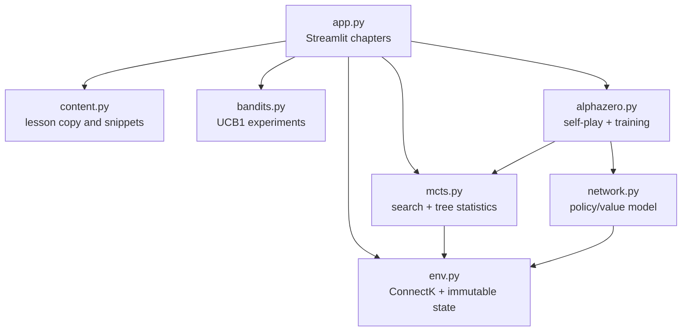

# RL Course Lab — Engineering Design

## 1. System shape

The app is a single Streamlit process with a pure-Python teaching library
underneath it. The UI owns session state; the RL modules do not depend on
Streamlit.



## 2. Repository layout

```text
app.py                    Streamlit entrypoint and visual components
rl_course/
  env.py                  GameConfig, GameState, ConnectK, encoding
  bandits.py              UCB1 score, stats, seeded bandit experiment
  mcts.py                 TreeNode, SearchResult, MCTS
  network.py              PolicyValueNet and combined loss
  alphazero.py            Self-play samples, trainer, evaluation
  content.py              Student-facing lesson text and code excerpts
tests/                    Unit and Streamlit smoke tests
docs/                     Product, engineering, deployment, troubleshooting
```

## 3. Public interfaces

### `rl_course.env`

- `GameConfig(rows=5, cols=6, target=4, gravity=True)` is a frozen game
  configuration.
- `GameState(board, current_player)` is a frozen tuple-backed state.
- `ConnectK.initial_state(current_player=1) -> GameState` creates an empty
  state.
- `ConnectK.legal_actions(state) -> tuple[int, ...]` returns column indices for
  gravity games or cell indices for free-placement games.
- `ConnectK.step(state, action, player=None) -> GameState` validates and applies
  one move without mutating the input state.
- `ConnectK.winner(state)`, `is_terminal(state)`, and `reward(state,
  perspective=1)` expose terminal semantics.
- `encode_state(state, player) -> np.ndarray` returns three channels: current
  player, opponent, and empty cells.

### `rl_course.bandits`

- `ucb1_score(mean, visits, total_visits, exploration_constant=1.414)` returns
  the empirical mean plus an exploration bonus. Unvisited arms return `+∞`.
- `BanditStats` owns visit counts and reward sums and provides `means`, `scores`,
  `update`, and deterministic `select` operations.
- `BanditSession(seed=7, arms=4, exploration_constant=0.8)` is the app’s
  persistent experiment state. `add_attempts(attempts)` appends any positive
  number of sequential UCB pulls; it has no fixed horizon.
- `run_ucb_experiment(seed=7, arms=4, horizon=40)` creates reproducible chart
  snapshots for tests and scripted demos. The live app instead uses
  `BanditSession` and can continue indefinitely. Both paths expose true means,
  observed pull values, and pre-selection UCB scores for the teaching tables;
  true means are display-only and never participate in selection.

### `rl_course.mcts`

- `TreeNode` stores a state, parent/action link, prior, visit count, value sum,
  and child map.
- `MCTS.search(state, player, simulations, seed, policy_value_fn=None,
  temperature=1.0) -> SearchResult` runs random-rollout MCTS when no evaluator
  is supplied and PUCT-like policy/value-guided search when one is supplied.
- `SearchResult` contains the root policy, visit counts, child values, selected
  action, root value, simplified tree rows, and the latest rollout trace.

The first simulation expands the root. Consequently, root child visit counts
sum to `simulations - 1`; the root itself receives the first visit. This is
intentional and is covered by the MCTS test.

### `rl_course.network`

- `PolicyValueNet(game, hidden=64)` is a small MLP with a shared trunk and two
  heads.
- `PolicyValueNet.forward(encoded)` returns policy logits and a scalar value.
- `PolicyValueNet.predict(state, player=None)` converts one game state to NumPy
  logits and a Python float.
- `policy_value_loss(policy_logits, values, target_policy, target_values)` is
  cross-entropy against the search policy plus MSE against the game outcome.

### `rl_course.alphazero`

- `TrainingConfig` controls game size, self-play episodes, search simulations,
  epochs, learning rate, and seed.
- `SelfPlaySample` stores a state, player perspective, search policy, and final
  outcome.
- `AlphaZeroTrainer.self_play()` creates samples using network-guided search.
- `AlphaZeroTrainer.train(samples=None)` updates the policy/value network and
  returns loss histories.
- `AlphaZeroTrainer.choose_action(state, simulations=None, seed=7)` searches for
  a deterministic action.
- `AlphaZeroTrainer.evaluate(games=20, seed=7)` measures wins as player 1
  against a seeded random player 2.

## 4. State and data flow

1. Streamlit initializes one `GameState` per interactive board in
   `st.session_state`.
2. A widget action calls `ConnectK.step`, creating a new immutable state.
3. Bandit and MCTS chapters derive visual statistics directly from their result
   objects; no UI state is written into the algorithm classes.
4. Training constructs encoded state tensors, collects search policies and
   outcomes, computes the combined loss, and stores the trainer in the current
   session.
5. The play chapter asks that trainer for an action and applies it through the
   same environment used by the student.

## 5. Algorithm conventions

- Player values are always `1` and `2`; the opponent is `3 - player`.
- `GameState.current_player` means the player who moves next.
- Rewards are zero for non-terminal positions and draws.
- MCTS values are normalized to the search root player’s perspective.
- Network inputs are canonicalized to the player-to-move perspective.
- Legal action masking occurs during MCTS expansion; policy logits may contain
  values for occupied columns, but occupied actions are never selected.

## 6. Testing strategy

The test suite is intentionally layered:

- `tests/test_env.py` checks gravity, free placement, wins, rewards, and invalid
  actions.
- `tests/test_bandits_mcts.py` checks UCB optimism, seeded reproducibility, and
  MCTS policy/visit invariants.
- `tests/test_network_trainer.py` checks tensor shapes, loss finiteness, sample
  format, and the small-agent evaluation baseline.
- `tests/test_app_smoke.py` runs every chapter through Streamlit’s testing API
  and exercises a board control plus repeated UCB1 guesses.

Run all tests with:

```bash
python -m pytest -q
```

## 7. Extension rules

When adding a lesson, put explanatory copy and short snippets in
`rl_course/content.py`; keep layout and widgets in `app.py`. When adding an RL
feature, first expose a pure interface in `rl_course/`, then add one focused
visualization and one test. Avoid putting random-number generation or game
rules directly in Streamlit callbacks.

## 8. Known engineering limitations

- Training is full-batch and intentionally small; it is not optimized for
  large experiments.
- There is no model checkpoint file or persistence layer in v1.
- Plotly charts are explanatory views, not a general tree editor.
- The app currently uses a single fixed default board configuration.
